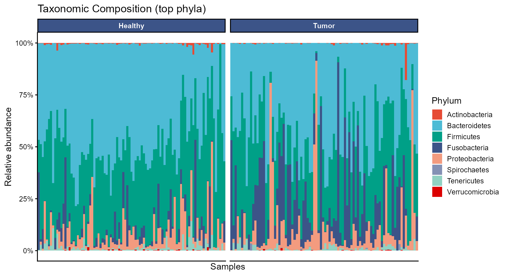
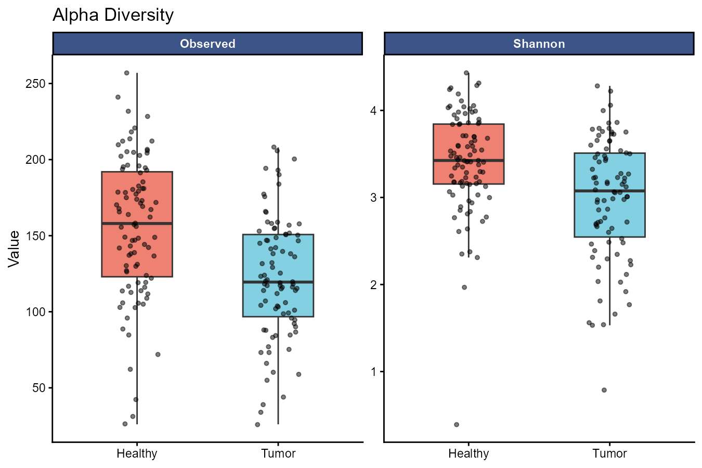
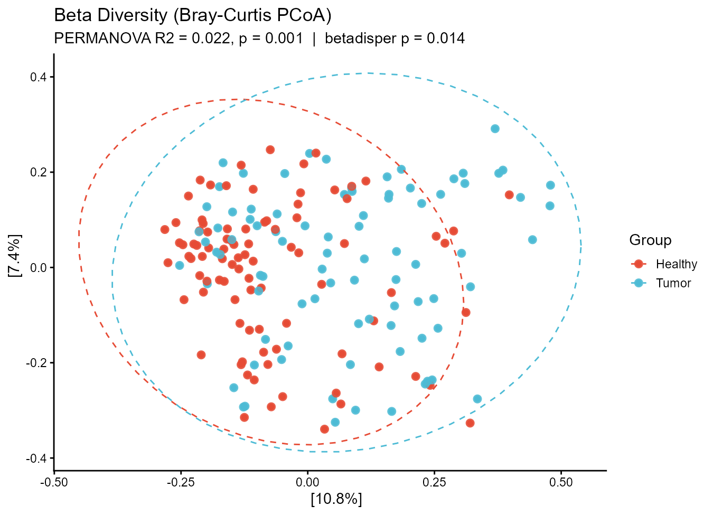
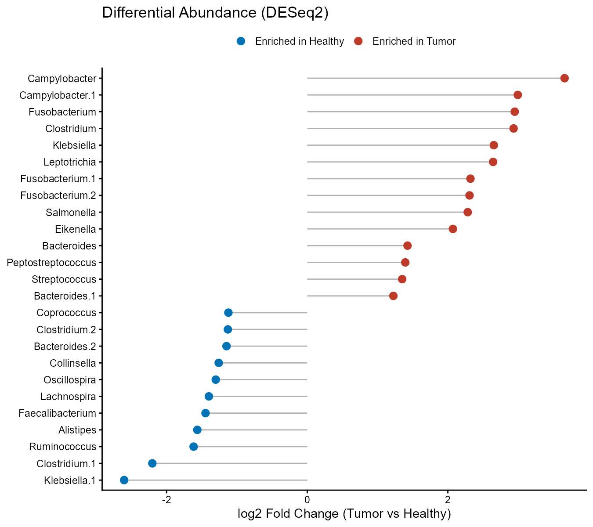
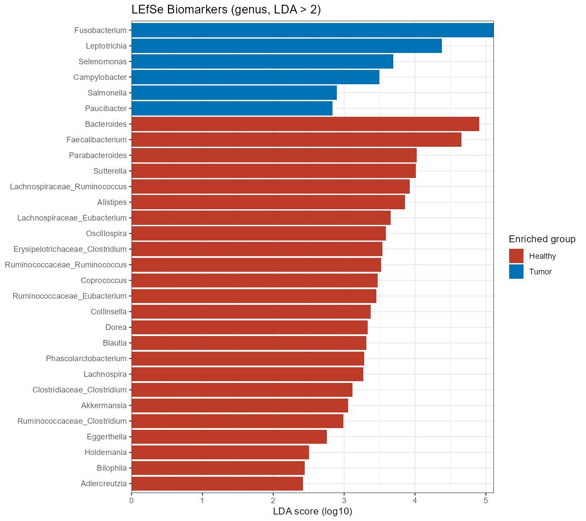

# 16S rRNA Microbiome Analysis Pipeline

A reproducible, **end-to-end R pipeline** for 16S rRNA amplicon data — from raw
sequencing reads to publication-ready diversity statistics, differential
abundance, and biomarkers.


> Demonstrated here on **public datasets only** — no private or client data is
> used anywhere in this repository.

---

## Overview

The pipeline is split into two stages that together cover the full workflow, from
raw reads to interpreted results:

| Stage | Script | Input | Output |
|-------|--------|-------|--------|
| **1 · Upstream** | `01_upstream_dada2.R` | Paired-end FASTQ reads | ASV table + taxonomy (`phyloseq` object) |
| **2 · Downstream** | `02_downstream_analysis.R` | Abundance table | Diversity, statistics, biomarkers, and figures |

**Stage 1 (upstream)** uses **DADA2** to turn raw Illumina reads into an amplicon
sequence variant (ASV) table: quality filtering, error learning, denoising, pair
merging, chimera removal, and taxonomy assignment against SILVA. It runs on the
canonical DADA2 tutorial dataset so the whole thing is fast and fully
reproducible; point it at your own FASTQ files to run the exact same steps on
real data.

**Stage 2 (downstream)** takes an abundance table and runs the complete community
analysis: taxonomic composition, alpha and beta diversity with statistical
testing, and differential abundance / biomarker discovery.

---

## Results

Stage 2 is shown here on **`kostic_crc`** (Kostic et al., 2012): a 16S gut
microbiome study comparing **Healthy vs Tumor** tissue in colorectal carcinoma.
The pipeline recovers the well-known cancer-associated signature — enrichment of
*Fusobacterium*, *Leptotrichia*, and *Campylobacter* in tumor tissue, and loss of
short-chain-fatty-acid producers such as *Faecalibacterium* — showing that the
workflow doesn't just run, it produces biologically coherent results.

**Taxonomic composition (top phyla)**



Relative abundance of the dominant phyla per sample, split by group. Bacteroidetes
and Firmicutes dominate both groups, with Fusobacteria noticeably elevated in
tumor samples.

**Alpha diversity**



Within-sample richness (Observed) and diversity (Shannon), compared between groups
with a Kruskal-Wallis test. Both indices are lower in tumor tissue.

**Beta diversity — Bray-Curtis PCoA**



Ordination of community composition, with **PERMANOVA** testing for a group effect
and **betadisper** checking group dispersion. Groups differ significantly in
composition (PERMANOVA R² = 0.022, p = 0.001).

**Differential abundance — DESeq2**



Genera significantly enriched in tumor vs healthy tissue (Wald test, BH-adjusted
p < 0.05), ranked by log2 fold change.

**Biomarkers — LEfSe**



Discriminant genera identified by **LEfSe** (Kruskal-Wallis + LDA, LDA score > 2),
colored by the group in which each is enriched.

---

## Data

Both datasets are public and are used strictly for demonstration:

- **Upstream demo** — DADA2 tutorial data (mouse gut, 16S V4, 2×250 MiSeq).
  Download: the `miseqsopdata.zip` set referenced in the DADA2 tutorial.
- **Downstream demo** — `kostic_crc`, bundled with the **`microbiomeMarker`**
  R package. Reference: Kostic et al. (2012), *Genome Research* 22:292–298.

Taxonomy in Stage 1 is assigned against the **SILVA v138.1** training set.

---

## Reproduce it

Requires R (≥ 4.2) and the following packages:

```r
install.packages("BiocManager")
BiocManager::install(c(
  "dada2", "phyloseq", "Biostrings", "DESeq2",
  "microbiomeMarker", "vegan"
))
install.packages("ggplot2")
```

Then run the stages in order:

```r
source("01_upstream_dada2.R")     # raw reads  -> ASV table   (demo data)
source("02_downstream_analysis.R")# abundance table -> figures (kostic_crc)
```

Stage 2 is self-contained (it loads `kostic_crc` directly), so you can run it on
its own to reproduce every figure above.

---

## Repository structure

```
16S-microbiome-analysis/
├── README.md
├── LICENSE
├── 01_upstream_dada2.R          # raw reads -> ASV table (DADA2)
├── 02_downstream_analysis.R     # abundance table -> diversity, stats, biomarkers
├── 01_composition.png
├── 02_alpha_diversity.png
├── 03_beta_pcoa.png
├── 04_deseq2.png
└── 05_lefse.png
```

---

## Tech stack

**R** · DADA2 · phyloseq · vegan · DESeq2 · microbiomeMarker · ggplot2

Analyses use journal-style palettes (NPG, NEJM) and a clean `theme_classic()`
figure style throughout.

---

## About

Bioinformatics for microbiome & amplicon data — quality control, diversity,
statistics, and publication-quality figures.

- **LinkedIn:** PENDIENTE_LINKEDIN_URL
- **ORCID:** PENDIENTE_ORCID_URL

*Available for freelance bioinformatics & data-analysis projects.*
