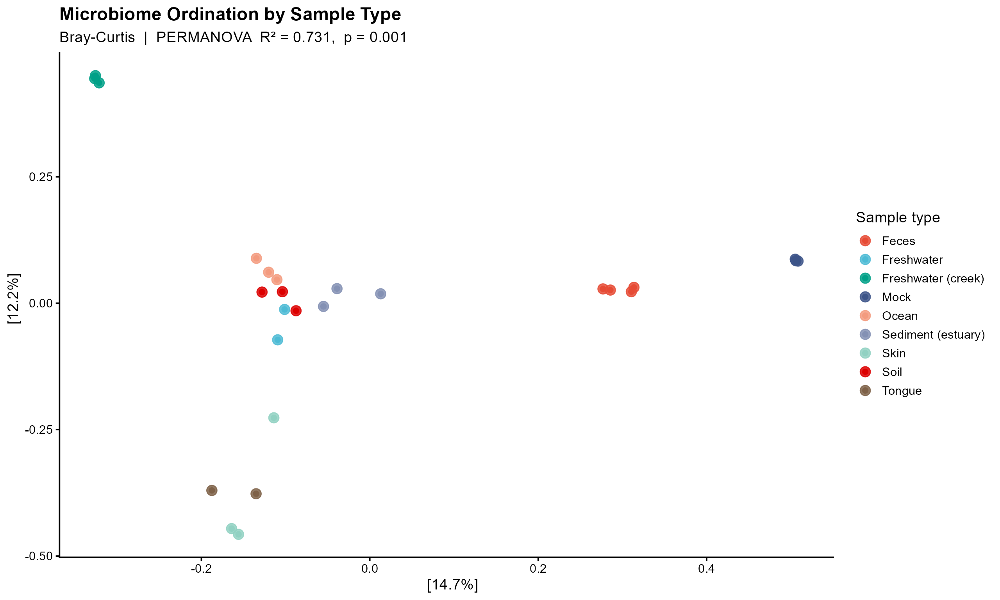
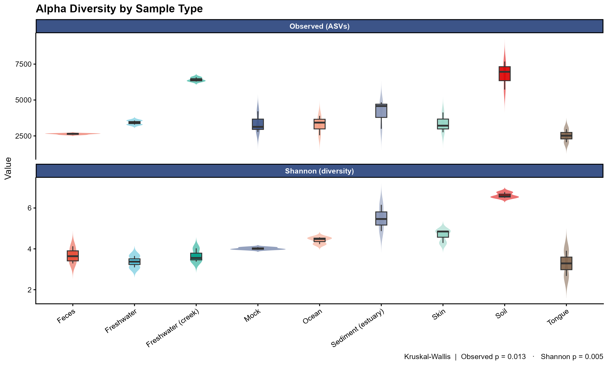

# 16S rRNA Microbiome Analysis Pipeline

A reproducible **R pipeline** for analyzing 16S rRNA amplicon data — from a community abundance table to publication-ready diversity statistics and figures. Demonstrated here on a public dataset, with no private data used.

---

## What this pipeline does

- **Beta diversity** — Bray-Curtis PCoA ordination with **PERMANOVA** significance testing
- **Alpha diversity** — Observed richness and Shannon index, with **Kruskal-Wallis** testing
- **Publication-quality figures** in R (`ggplot2`, journal-style NPG palette)
- Fully **reproducible**: one script, public data, deterministic output

---

## Results (example on public data)

**Community composition — Bray-Curtis PCoA**



Ordination of microbial communities across sample types, with a PERMANOVA test quantifying how much of the variation is explained by group.

**Alpha diversity — Observed richness & Shannon index**



Within-sample diversity across sample types, compared with a Kruskal-Wallis test.

#------------------------------------------------------------------------------------#

## Dataset

This demo uses **GlobalPatterns**, a public 16S rRNA dataset bundled with the `phyloseq`
package (Caporaso et al., 2011). It is included here purely to demonstrate the workflow —
the same pipeline applies to any 16S dataset.

#------------------------------------------------------------------------------------#

## Tools

`R` · `phyloseq` · `vegan` · `ggplot2`

#-----------------------------------------------------------------------------------#

## How to run

```r
# 1. Install dependencies (once)
install.packages(c("vegan", "ggplot2"))
if (!requireNamespace("BiocManager", quietly = TRUE)) install.packages("BiocManager")
BiocManager::install("phyloseq")

# 2. Run the analysis
source("analysis.R")
```

This produces two figures: `pcoa_public.png` and `alpha_public.png`.

#------------------------------------------------------------------------------------#

## About

I'm a biologist working in bioinformatics, specialized in microbiome and amplicon analysis.
I turn raw sequencing data into clean, publication-ready results — pipelines, statistics,
and figures you can defend.

Available for freelance bioinformatics and data-analysis projects.
Feel free to connect on https://www.linkedin.com/in/jos%C3%A9-alejandro-v%C3%A1zquez-d%C3%ADaz-0702711b5/
